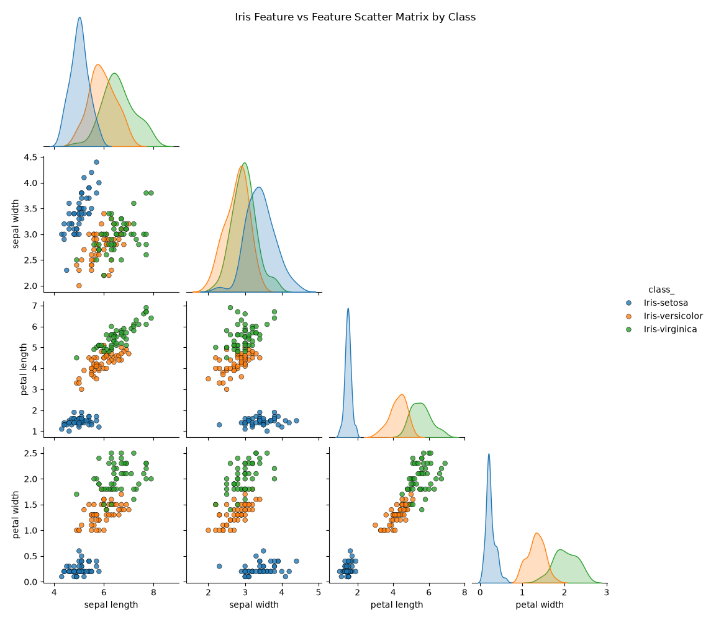
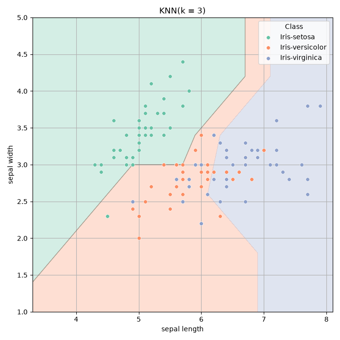
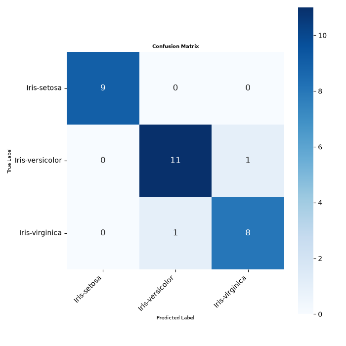

# Homework 1: Iris Classification with K-Nearest Neighbors (KNN)

This repository contains two implementations of the Homework 1 assignment for Data Mining Techniques, using K-Nearest Neighbors (KNN) as a classifier on the Iris dataset:

1. **`Homework1.py`**: A Python implementation with no scikit-learn dependency. The train-test split, KNN algorithm, confusion matrix calculation, and evaluation metrics are all written from scratch.
2. **`Homework_1.ipynb`**: The same pipeline using **`scikit-learn`** (`train_test_split`, `KNeighborsClassifier`, `make_pipeline`, and `ConfusionMatrixDisplay`).

Both produce equivalent results: downloading the Iris dataset, visualizing feature pairplots, splitting data (80/20 train-test, `random_state=7`), fitting a 3-NN classifier, and evaluating performance via confusion matrices and metrics.

---

## Dataset

The [Iris dataset](https://archive.ics.uci.edu/dataset/53/iris) (UCI ID 53) — 150 samples, 4 features (sepal/petal length and width), 3 classes (*Iris-setosa*, *Iris-versicolor*, *Iris-virginica*).

---

## Repository Structure

- `Homework1.py` — Custom Python implementation of KNN, train-test split, and metrics.
- `Homework_1.ipynb` — Scikit-learn based Jupyter Notebook pipeline.
- `images` — Graphs.
- `requirements.txt` — Python package dependencies.
- `README.md` — Project documentation and run guide.

---

## Installation & Setup

1. **Clone the repository:**
   ```bash
   git clone https://github.com/AchintyaShah25/DataMiningTechniquesHW1.git
   cd DataMiningTechniquesHW1
   ```

2. **Create and activate a virtual environment:**
   - macOS/Linux:
     ```bash
     python3 -m venv venv
     source venv/bin/activate
     ```
   - Windows:
     ```bash
     python -m venv venv
     venv\Scripts\activate
     ```

3. **Install the dependencies:**
   ```bash
   pip install -r requirements.txt
   ```

---

## How to Run

### Python Script

```bash
python Homework1.py
```
Fetches the dataset, displays the scatterplot matrix, trains the custom KNN model, and outputs the text-based confusion matrix and metrics to console, plus a confusion matrix heatmap.

### Jupyter Notebook

```bash
jupyter notebook Homework_1.ipynb
```
Select the kernel corresponding to your virtual environment and run all cells sequentially.

---

## Feature Scatter Matrix



The plot above shows every pairwise combination of the four features colored by class, with each feature's individual distribution plotted along the diagonal.


---

## Decision Boundary Visualization




The plot above shows the decision regions learned by the 3-NN classifier on  sepal length and sepal width. Each shaded region represents the area of feature space where a new point would be classified as Iris-setosa in green, Iris-versicolor in orange, or Iris-virginica in purple, based on a majority vote among its 3 nearest training neighbors.


---


## Confusion Matrix



The plot above describes the custom built confusion matrix, which summarizes the classifier's performance

---


## Results

*(80/20 train-test split, random_state=7, k=3; 30 test samples)*

| Metric | `Homework1.py` | `Homework_1.ipynb` |
|---|---|---|
| Accuracy | 93.33% | 90.00% |
| Macro Precision | 0.9352 | 0.9154 |
| Macro Recall | 0.9352 | 0.9116 |
| Macro F1 Score | 0.9352 | 0.9124 |
| Weighted Precision | 0.9333 | 0.9018 |
| Weighted Recall | 0.9333 | 0.9000 |
| Weighted F1 Score | 0.9333 | 0.8996 |

The two implementations don't produce identical numbers because they split the data differently. The custom script shuffles indices with np.random.seed(7), while the notebook uses scikit-learn's train_test_split(), the same seed doesn't guarantee the same split across two different shuffling algorithms. However, the results of both the scripts land in the same range.
